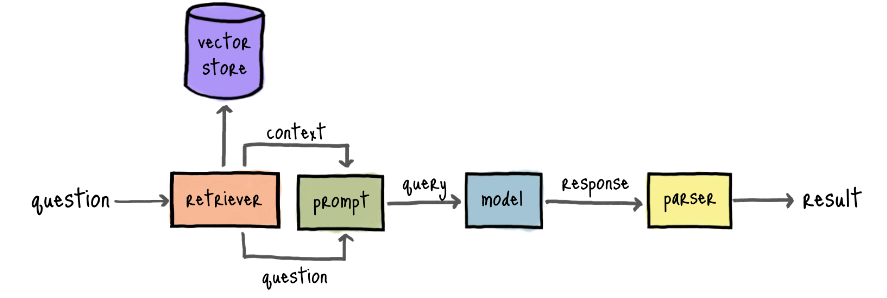

# BIU_LLM_Project
# RAG System for Bar Ilan University- Course Chatbot  

## Project Overview  
This project aims to create a **Retrieval-Augmented Generation (RAG)** system that powers a Chatbot application designed to assist prospective students interested in Bar Ilan University courses. The Chatbot uses advanced AI capabilities to provide detailed and accurate information by extracting and understanding content from PDF syllabus files.  

## Features  
- **Accurate Information Retrieval**: Combines a retrieval mechanism with generative AI to deliver precise responses based on course syllabus.  
- **PDF-based Training**: The model learns from syllabus files, ensuring that responses align closely with university-provided information.  
- **User-Friendly Chat Interface**: Designed to make querying courses simple and accessible for new students.  
- **Customizable**: The system can be updated with new syllabus or documents as needed.  

## Components  
1. **Data Processing**:  
   - Flattening PDF files into a JSON structured format files for training the system.  
2. **Embedding Model**:  
   - Leveraging OpenAI embedding models to create efficient and meaningful document representations.  
3. **Chunking and Indexing Into Vector DB**:  
   - Building a searchable index using tools like LlamaIndex and Pinecone for fast and relevant data retrieval.  
4. **Generative Model**:  
   - Utilizing GPT 4.o-based models for generating coherent, user-friendly responses.  
5. **Front End**:  
   - Merging the retrieval and generation components into a seamless Chatbot experience using Gradio Chat.  

## Usage  
1. **Input PDFs**: Add syllabus files to the designated folder using Amazon S3.
2. **Build the Index**: Run the indexing script to process documents and prepare the system for queries.  
3. **Start the Chatbot**: Launch the application to begin interacting with the AI assistant.  

## How It Works  
1. **User Query**: The student inputs a question, e.g., "What are the prerequisites for the Computer Science course?"  
2. **Information Retrieval**: The system searches the indexed PDF content for relevant information.  
3. **Response Generation**: Using GPT, the system crafts a detailed and accurate reply based on the retrieved data. 

## Future Enhancements  
- Expand document support to include additional materials like course guides or FAQs.  
- Incorporate multilingual capabilities for international students.  
- Develop advanced analytics to track popular queries and improve system responses.  

## Getting Started  
To set up and run the system, please refer to the installation and setup instructions in the `docs` folder.  
For any questions or contributions, please contact the development team.  
